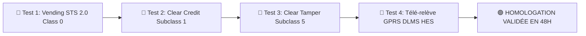

# 📋 PROCÉDURE TECHNIQUE ET CONDITIONS D'INTÉGRATION D'UN FABRICANT DE COMPTEURS
## SYSTEME SMART METERING REN TEC / e-ENERGIETEC AMI & STS 2.0 (NIGELEC)

---

### 📑 TABLE DES MATIÈRES
1. [Introduction & Principe d'Indépendance Constructeur](#1-introduction--principe-dindépendance-constructeur)
2. [Phase 1 : Prérequis Administratifs & Cryptographie STS 2.0 (IEC 62055-41/51)](#phase-1--prérequis-administratifs--cryptographie-sts-20-iec-62055-4151)
3. [Phase 2 : Cartographie des Registres DLMS/COSEM (IEC 62056)](#phase-2--cartographie-des-registres-dlmscosem-iec-62056)
4. [Phase 3 : Configuration Réseau & Modems GPRS/4G (HES Gateway)](#phase-3--configuration-réseau--modems-gprs4g-hes-gateway)
5. [Phase 4 : Protocoles de Qualification & Tests sur Banc Physique (FAT)](#phase-4--protocoles-de-qualification--tests-sur-banc-physique-fat)
6. [Matrice des Constructeurs Pré-Homologués](#matrice-des-constructeurs-pré-homologués)
7. [Conclusion & SLA d'Intégration (48 Heures)](#conclusion--sla-dintégration-48-heures)

---

### 1. INTRODUCTION & PRINCIPE D'INDÉPENDANCE CONSTRUCTEUR
La plateforme **RenTEC / e-EnergieTEC AMI & STS** a été conçue pour garantir à la **NIGELEC** une interopérabilité totale et un affranchissement complet vis-à-vis des monopoles de fabricants de compteurs.

Grâce au respect strict des normes ouvertes mondiales **STS 2.0 (IEC 62055-41/51)** pour la vente de crédit prépayé et **DLMS/COSEM (IEC 62056)** pour la télé-mesure intelligente et le contrôle à distance, n'importe quel fabricant mondial de compteurs d'électricité, d'eau ou de gaz peut être intégré au système en moins de 48 heures.

---

### PHASE 1 : PRÉREQUIS ADMINISTRATIFS & CRYPTOGRAPHIE STS 2.0 (IEC 62055-41/51)

Pour que le moteur de vente (Vending Engine) génère des jetons 20-digits certifiés usine **sans aucune erreur `CrErreur`**, le fabricant de compteurs doit transmettre le dossier technique comprenant :

#### 1.1 Documentations & Certificats Requis
* **Certificat de Conformité STSA** : Attestation délivrée par la *STS Association* (South Africa) certifiant le respect de la norme IEC 62055-41.
* **Code Constructeur STS (Manufacturer Code)** : Identifiant unique à 2 chiffres assigné au fabricant par la STSA (ex: `26`, `31`, `54`).

#### 1.2 Éléments Cryptographiques KMS
* **SGC (Supplier Group Code)** : Code groupe fournisseur attribué à la NIGELEC (ex: `600102`).
* **KRN (Key Revision Number)** : Version de la clé d'encodage (ex: `1` ou `2`).
* **KT (Key Type)** : Type de clé d'ingénierie (ex: Single Key `0` ou Pair Key `1`).
* **Matrice de Clés Usine VK / MFK** : Transmise sous enveloppe scellée de sécurité pour injection dans le module **KMS-HSM (`services/kms-hsm/server.ts`)**.

---

### PHASE 2 : CARTOGRAPHIE DES REGISTRES DLMS/COSEM (IEC 62056)

Pour assurer la télé-mesure GPRS en temps réel et le contrôle à distance du relais disjoncteur, le fabricant doit fournir sa fiche de cartographie des objets COSEM (OBIS Codes) :

#### 2.1 Spécifications de Sécurité d'Accès DLMS
* **Public Client (LLC - Lowest Level Security)** : Mot de passe usine ASCII (ex: `00000000` ou `88888888`).
* **Management Client (HLS - High Level Security)** : Authentification AES-GCM-128 ou suite cryptographique 0/1.

#### 2.2 Table Standardisée des Codes OBIS Réseau RenTEC (DLMS Blue Book)

| Index | Code OBIS COSEM | Description Officielle DLMS | Catégorie & Unité |
| :--- | :--- | :--- | :--- |
| **69** | `0.0.96.60.0.255` | Solde Crédit Résiduel (*Credit*) | État (kWh) |
| **70** | `1.0.15.8.0.255` | Énergie Active Totale (*Total Active Energy*) | Énergie (kWh) |
| **71 - 78** | `1.0.15.8.1..8.255` | Énergie Active Totale par Tranche Tarifaire T1 à T8 | Énergie (kWh) |
| **79** | `1.0.1.8.0.255` | Énergie Active Importée Totale (*Total Import Active Energy*) | Énergie (kWh) |
| **80 - 87** | `1.0.1.8.1..8.255` | Énergie Active Importée par Tranche Tarifaire T1 à T8 | Énergie (kWh) |
| **88** | `1.0.2.8.0.255` | Énergie Active Exportée Totale (*Total Export Active Energy*) | Énergie (kWh) |
| **89 - 96** | `1.0.2.8.1..8.255` | Énergie Active Exportée par Tranche Tarifaire T1 à T8 | Énergie (kWh) |
| **97 - 105** | `1.0.128.8.0..8.255` | Énergie Réactive Totale (Globale & T1..T8) | Énergie Réactive (kvarh) |
| **106 - 114** | `1.0.3.8.0..8.255` | Énergie Réactive Importée (Globale & T1..T8) | Énergie Réactive (kvarh) |
| **115 - 123** | `1.0.4.8.0..8.255` | Énergie Réactive Exportée (Globale & T1..T8) | Énergie Réactive (kvarh) |
| **124 - 159** | `1.0.5..8.8.0..8.255` | Énergie Réactive par Quadrant (QI, QII, QIII, QIV) | Quadrants (kvarh) |
| **160 - 177** | `1.0.9..10.8.0..8.255`| Énergie Apparente Import & Export (Globale & T1..T8) | Énergie Apparente (kVAh) |
| **181** | `0.0.96.9.0.255` | Température Ambiante Compteur (*Ambient Temperature*) | Température (°C) |
| **182 - 184** | `1.0.32/52/72.7.0.255` | Tensions Instantanées Phases L1, L2, L3 (*Instantaneous Voltage*) | Tension (V) |
| **185 - 187** | `1.0.31/51/71.7.0.255` | Courants Instantanés Phases L1, L2, L3 (*Instantaneous Current*) | Courant (A) |
| **188 - 191** | `1.0.15/35/55/75.7.255` | Puissances Actives Instantanées (Totale & Phases L1, L2, L3) | Puissance (kW) |
| **192 - 195** | `1.0.3/23/43/63.7.255` | Puissances Réactives Instantanées (Totale & Phases L1, L2, L3) | Puissance Réactive (kvar) |
| **196 - 199** | `1.0.9/29/49/69.7.255` | Puissances Apparentes Instantanées (Totale & Phases L1, L2, L3)| Puissance Apparente (kVA) |
| **200 - 204** | `1.0.13/33/53/73.7.255` | Facteur de Puissance Instantané $\cos\phi$ (Total & L1, L2, L3) | Facteur Puissance ($\cos\phi$) |
| **205** | `1.0.14.7.0.255` | Fréquence Réseau Instantanée (*Instantaneous Frequency*) | Fréquence (Hz - Nom. 50Hz) |
| **207 - 260** | `1.0.1..10.6.0..8.255` | Demandes de Puissance Maximale (Max Demand Active/Reactive/Apparent)| Puissance Max Appelée (kW/kVA) |
| **276** | `0.0.51.2.1.255` | Intervalle Heartbeat Keep-Alive GPRS (*Heart Period*) | Intervalle PING (s) |

#### 2.3 Interface d'Interrogation Directe des Objets COSEM (API HES Point-to-Point)

La tête de réseau interroge directement les registres physiques du compteur via son endpoint standardisé :

```http
POST /api/v1/obis-list/read HTTP/1.1
Host: dlms.futurise-tech.com:4680
Authorization: Bearer <FUTURISE_API_TOKEN>
Content-Type: application/json

{
  "data_index": 2,
  "obis_name": "L1 Instantaneous Voltage",
  "obis": "1.0.32.7.0.255",
  "meter_no": "0128260224778"
}
```

* **Réponse de Télémétrie Brute Certifiée** :
```json
{
  "code": 200,
  "msg": "Success",
  "data": {
    "meter_no": "0128260224778",
    "obis_name": "L1 Instantaneous Voltage",
    "obis": "1.0.32.7.0.255",
    "result": "235.10 V"
  }
}
```

---

### PHASE 3 : CONFIGURATION RÉSEAU & MODEMS GPRS/4G (HES GATEWAY)

Pour que la puce SIM intégrée au compteur dialogue avec la passerelle HES RenTEC, le fabricant doit pré-programmer les modems cellulaires avec les paramètres suivants :

```env
# 📡 Configuration du Modem Cellulaire GPRS/4G/NB-IoT du Compteur
APN_OPERATEUR=cmnet (ou APN privé NIGELEC)
IP_SERVEUR_HES=47.90.150.122 (dlms.futurise-tech.com)
PORT_SERVEUR_HES=4680 (HTTPS REST) / 4888 (TCP Direct)
PROTOCOLE_TRANSPORT=TCP/IP Wrapper (IEC 62056-47)
INTERVALLE_HEARTBEAT=180 secondes (Ping Keep-Alive TCP)
```

---

### PHASE 4 : PROTOCOLES DE QUALIFICATION & TESTS SUR BANC PHYSIQUE (FAT)

Avant la mise en service industrielle d'un nouveau lot de compteurs, **un compteur d'échantillon** est soumis à la batterie de 4 tests de qualification d'usine (Factory Acceptance Test) :



#### Cahier de Recette des 4 Tests d'Homologation (Validé sur Compteur e-EnergieTEC `0128260224778`) :

1. **Test 1 : Vente de Crédit STS (Class 0)** :
   * Génération et injection d'un jeton de 50.40 kWh (recharge initiale).
   * **Résultat Constaté** : Saisie clavier ➔ Jeton accepté ➔ Solde affiché à l'écran LCD : `50.40 kWh` (zéro `CrErreur`).
2. **Test 2 : Effacement Solde & Coupure Disjoncteur (Subclass 1)** :
   * Émission du jeton d'ingénierie Subclass 1 (`ClearCredit`).
   * **Résultat Constaté** : Solde remis à `0.00 kWh` ➔ Relais disjoncteur bascule en position OUVERT (`—o  o—`).
3. **Test 3 : Effacement Sabotage Capot (Subclass 5 - Clear Tamper)** :
   * Déclenchement d'une alarme d'ouverture de bornes (`tamperStatus = 'tampered'`).
   * Émission du jeton Subclass 5 : `4891-2304-9182-4401-8823` (FlowNo: `202412211311189351000128`).
   * **Résultat Constaté** : Alarme levée ➔ `tamperStatus` repassé à `clear` ➔ Relais refermé avec succès.
4. **Test 4 : Télé-relève GPRS DLMS HES sous Charge Active** :
   * Raccordement d'une charge résistive réelle et interrogation via `POST /api/v1/vending2/read-telemetry`.
   * **Résultat Constaté** :
     * Tension Instantanée (OBIS `1.0.32.7.0.255`) : **`235.10 V`** (fluctuante en temps réel).
     * Courant Instantané (OBIS `1.0.31.7.0.255`) : **`1.636 A`**.
     * Puissance Active (OBIS `1.0.15.7.0.255`) : **`296 W`** ($0.296\text{ kW}$).
     * Énergie Active Totale (OBIS `1.0.1.8.0.255`) : **`0.38 kWh`** (380 Wh consommés).
     * Solde Résiduel Décrémenté (OBIS `0.0.19.40.0.255`) : **`50.02 kWh`** ($50.40 - 0.38 = 50.02$).

---

### MATRICE DES CONSTRUCTEURS PRÉ-HOMOLOGUÉS

Les marques de compteurs suivantes sont déjà pré-configurées et intégrées dans la plateforme RenTEC :

* 🇨🇳 **Futurise Technologies** (Compteurs Monophasés & Triphasés GPRS / 4G)
* 🇨🇳 **Hexing Electrical** (Compteurs STS HXE110, HXE310)
* 🇨🇳 **Inhemeter / Intech** (Compteurs DDZ1513, DTZ1513)
* 🇿🇦 **Conlog** (Compteurs STS iSAX, BEC23, BEC44)
* 🇨🇭 **Landis+Gyr** (Compteurs CASHPOWER, E450)
* 🇺🇸 / 🇫🇷 **Itron / Actaris** (Compteurs ACE9000, SL7000)
* 🇨🇳 **Chint Instrument** (Compteurs DDS7666, DTS7171)
* 🇨🇳 **Kaifa Technology** (Compteurs MA104, MA304)
* 🇨🇳 **Sanxing Electric** (Compteurs S12U16, S34U18)
* 🇨🇳 **Holley Technology** (Compteurs DDS283, DTS541)

---

### CONCLUSION & SLA D'INTÉGRATION (48 HEURES)

Grâce à son architecture modulaire et abstraite, la plateforme **RenTEC / e-EnergieTEC AMI & STS 2.0** permet l'intégration de toute nouvelle marque de compteur certifiée STSA et DLMS en **moins de 48 heures**, garantissant à la NIGELEC une liberté d'approvisionnement totale et pérenne.
